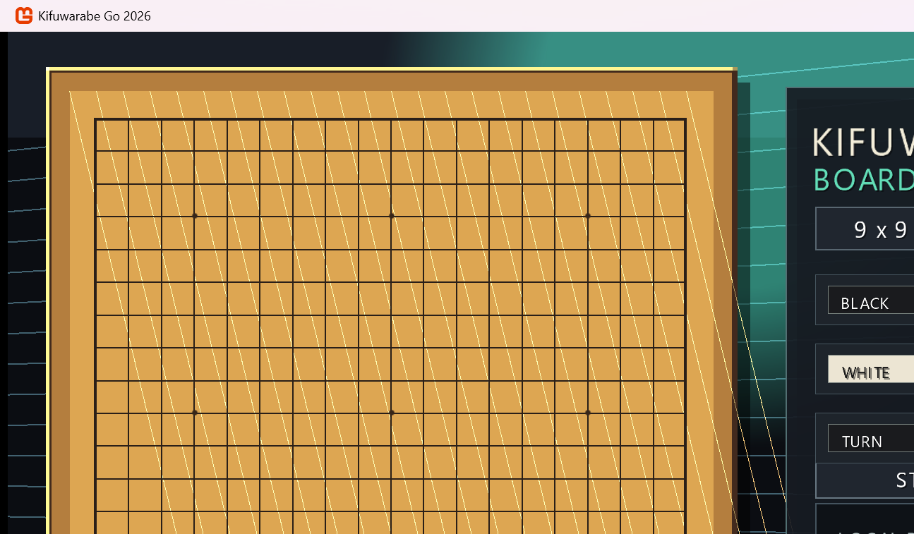

# 開発日誌 2026年7月

KifuwarabeGo2026 の 2026年7月分の開発日誌です。
上から下へ、古い日付から新しい日付の順に並べます。

## 2026-07-07

新しいリポジトリーとして `KifuwarabeGo2026` の方針を整理しました。

- コンピューター囲碁の思考エンジンを C# で作ることにしました。
- 画面表示には MonoGame を使うことにしました。
- 対局プロトコルには Go Text Protocol (GTP) を使う方針にしました。
- 標準入力と標準出力は GTP 専用にし、アプリケーション操作は画面上の UI で行う方針にしました。
- `Docs/README.md`、`Docs/続きはここから.md`、`Docs/設計/基本方針.md` を作り、作業再開時に見ればよい情報を残しました。

## 2026-07-08

MonoGame 上の囲碁画面を作り、画面操作の土台を入れました。

- フルHD想定の囲碁画面を作りました。
- 9路、13路、19路の盤サイズを切り替えられるようにしました。
- 描画処理を `Presentation/GoScreenRenderer.cs` へ分けました。
- 仮想スクリーン変換を `Presentation/VirtualScreen.cs` へ分けました。
- Esc キー終了をやめ、Windows の標準操作である Alt+F4 終了に寄せました。
- アプリの状態として、対局中、局面編集中、鑑賞中、休憩中を表すクラスを用意しました。
- 休憩中から対局中へ切り替える START ボタンを作りました。
- 対局中は、盤上の交点を左クリックして黒石と白石を交互に置けるようにしました。
- PASS ボタンで手番を進められるようにしました。
- 石を置ける交点へマウスを近づけると、現在の手番の石を薄く表示するようにしました。
- 石を置いたときとパスしたときに短い効果音を鳴らすようにしました。
- 今日の到達点として、開発日誌とスクリーンショットを追加しました。

## 2026-07-09

GTP エンジン連携の最初の段階を実装しました。

- GUI のセットアップ画面で、黒番・白番を `Human` / `Computer` から選べるようにしました。
- `KifuwarabeGo2026.Engine` コンソールプロジェクトを追加しました。
- ランダム合法手を返す最小 GTP エンジンを作りました。
- エンジンは標準入力から GTP コマンドを読み、標準出力へ GTP 応答だけを返します。
- GUI 側に `GtpEngineClient` と GTP 座標変換の土台を追加しました。
- `dotnet build KifuwarabeGo2026.slnx` が成功することを確認しました。
- エンジン単体で `protocol_version`、`boardsize 9`、`play black D4`、`genmove white`、`quit` の応答を確認しました。
- GUI の対局開始時に GTP エンジンを起動し、`boardsize` と `clear_board` を送るようにしました。
- 人間の着手とパスを、`play black D4` や `play white pass` の形でエンジンへ同期するようにしました。
- `Computer` 手番では `genmove` を送り、返ってきた手を GUI 側の合法手処理へ通して盤へ反映するようにしました。
- エンジン準備中や思考中は盤を隠し、`コンピューター準備中` と `対局をキャンセル` ボタンを表示するようにしました。
- 準備が終わっていないのに盤が表示される問題を直しました。
- 準備中画面の日本語表示が文字化けしていたため、フォント設定を直しました。
- 今日は遅いので、スクリーンショットは追加しませんでした。

## 2026-07-10

GTP エンジン連携を進め、エラー表示、終局時の後始末、複数エンジンプロセス化の途中まで進めました。

- エンジンエラー時に、盤面領域へ `エンジンエラー`、エラー内容、GTPログ保存先を表示するようにしました。
- 対局中の右パネルに `ENGINE` 状態として `STARTING` / `THINKING` / `READY` / `ERROR` を表示するようにしました。
- セッション状態に `EngineLogPath` を追加しました。
- 投了、二連続パス、コンピューター着手による終局時に GTP エンジンプロセスを閉じるようにしました。
- 黒番・白番を両方 `Computer` にした場合に備え、黒用・白用の GTP エンジンプロセスを別々に起動する実装へ変更中です。
- コンピューターが打った手を、着手した本人以外の GTP エンジンへ `play` で同期する処理を追加しました。
- 共有ログ `logs/gtp.log` に `[black-engine]` / `[white-engine]` の接頭辞を付けるようにしました。
- セットアップ画面で `Computer` 選択時に、既定エンジン名 `Kifuwarabe Random GTP` を表示するようにしました。
- `Docs/開発/GTPエンジン連携実装計画.md` の古い未実装記述を、現在の実装状況へ合わせて更新しました。
- `dotnet build KifuwarabeGo2026.slnx` が警告なしで成功することを確認しました。
- 終局時の GTP エンジン終了処理追加後、`dotnet build KifuwarabeGo2026.slnx` が警告なしで成功することを確認しました。
- 複数 GTP エンジンプロセス化の途中実装後、`dotnet build KifuwarabeGo2026.slnx` が警告なしで成功することを確認しました。
- エンジン単体で `protocol_version`、`name`、`boardsize 9`、`clear_board`、`play black D4`、`genmove white`、`quit` の応答を確認しました。
- 次は、黒番 `Computer`、白番 `Computer` で実際に対局を開始し、別プロセス同士で自動着手と相手手同期が進むか確認します。

## 2026-07-12

設定画面まわりの操作性を大きく整え、盤面の連解析表示を追加しました。

- 純碁スコアによる勝敗判定を入れ、結果画面に「何手で終局したか」を表示するようにしました。
- タイトル画面に残っていた不要な `MODE RESTING` 表示を削除しました。
- 大会ルール設定を追加パネルへ分離し、表示名入力、ファイル参照、編集、削除、複製をできるようにしました。
- テキストボックスへキーリピート、クリック位置へのキャレット移動、キャレット位置補正を入れ、表示名入力を扱いやすくしました。
- 思考エンジン設定パネルにも追加、編集、削除、複製を入れ、実行ファイルとワーキングディレクトリーを参照ボタンから選べるようにしました。
- `HUMAN` / `COMPUTER` の選択を一体型セグメントに寄せ、ボタン、ラベル、設定項目の見た目を調整しました。
- 大会ルール設定パネルと思考エンジン設定パネルのラベル表現を共通化し、押せる場所と読ませる場所の見分けを付けやすくしました。
- 盤面を左上から走査して、黒連、白連、空連へ分割し、連番号を振る連解析を実装しました。
- `R` キーで連解析表示を切り替え、盤上に連番号と連の境界を重ねて表示できるようにしました。
- 連解析結果は盤面サイズと盤面ハッシュでキャッシュし、同じ局面では再解析しないようにしました。
- README の上部にリンク集を追加し、リリースページと開発日誌へすぐ移動できるようにしました。
- README のドキュメント節にあった開発日誌リンクは、上部リンク集へ移して重複を減らしました。
- CGOS 練習サーバーへ接続する独立プロジェクト `KifuwarabeGo2026.Gui.Communication.Cgos` を追加しました。
- CGOS 通信クライアントは `uec-go.com:6809` へ接続し、黒番 `KifuwarabeB`、白番 `KifuwarabeW` でログインできるようにしました。
- CGOS 通信クライアントは `Ctrl+C` 時に CGOS へ `quit` を送って切断し、起動中の GTP エンジンも終了するようにしました。
- GUI の最初の選択画面に `Local (推奨)` と `Connect To CGOS` を追加しました。
- ローカル利用と CGOS 接続を見分けやすいよう、閉じた箱と外部サーバーへつながる箱のアイコンを描画しました。
- `Connect To CGOS` から進む CGOS 接続先リスト画面を追加しました。
- CGOS 接続先リストに `PREV`、`NEXT`、`ADD`、`EDIT`、`DUPLICATE`、`DELETE` を追加しました。
- CGOS 接続先プロファイルの追加、編集、複製、削除、ページ移動をできるようにしました。
- 編集パネルで `DISPLAY NAME`、`HOST`、`PORT`、`ROLE`、`NOTE` を編集できるようにしました。
- CGOS 接続先プロファイルを `Content/CgosConnections/cgos-connection-list.json` へ JSON 形式で保存するようにしました。
- 次回は、`Connect To CGOS` の接続先を選んだ後、実際の接続開始画面または接続中画面へ進む部分から作ります。

## 2026-07-13

`Connect To CGOS` の接続先選択後のフローを進めました。

- CGOS 接続先リストに `CONNECT` ボタンを追加しました。
- 選択中の接続先から、接続開始画面へ進めるようにしました。
- 接続開始画面で `TARGET` と `STATUS` を確認できるようにしました。
- `START CONNECT` ボタンを追加し、GUI 側で接続開始要求状態を持てるようにしました。
- `BACK` で接続開始画面から接続先リストへ戻れるようにしました。
- `dotnet build KifuwarabeGo2026.slnx` が警告なしで成功することを確認しました。
- GUI の `START CONNECT` から `KifuwarabeGo2026.Gui.Communication.Cgos` を起動できるようにしました。
- 接続中は `START CONNECT` を `STOP CONNECT` に切り替え、標準入力へ `quit` を送って通信クライアントを停止できるようにしました。
- CGOS 通信クライアントは標準入力の `quit`、`exit`、`cancel` でもキャンセルし、既存のログアウト処理で CGOS へ `quit` を送るようにしました。
- `dotnet build KifuwarabeGo2026.slnx` が警告なしで成功することを確認しました。
- CGOS 通信クライアントの標準出力と標準エラーの最新行を GUI 側で保持するようにしました。
- 接続開始画面の `STATUS` に `MESSAGE` 欄を追加し、接続処理の直近メッセージを見られるようにしました。
- `dotnet build KifuwarabeGo2026.slnx` が警告なしで成功することを確認しました。
- 接続開始画面の `ACCOUNT` を `BLACK`、`WHITE`、`BOTH` から選べるようにしました。
- GUI から起動する CGOS 通信クライアントへ、選択したアカウントを `--account black`、`--account white`、`--both` として渡すようにしました。
- `dotnet build KifuwarabeGo2026.slnx` が警告なしで成功することを確認しました。
- 接続開始画面の `ENGINE` を既存の GTP エンジンプロファイルから `PREV` / `NEXT` で選べるようにしました。
- GUI から起動する CGOS 通信クライアントへ、選択した GTP エンジンを `--engine-command` として渡すようにしました。
- `dotnet build KifuwarabeGo2026.slnx` が警告なしで成功することを確認しました。
- 接続開始画面の `ENGINE` に、選択中プロファイルの表示名と実行ファイル名、引数の概要を表示するようにしました。
- CGOS 通信クライアント起動時に、渡した engine command を `MESSAGE` 欄へ表示するようにしました。
- `dotnet build KifuwarabeGo2026.slnx` が警告なしで成功することを確認しました。
- 接続開始画面の `MESSAGE` 欄を下段の横長表示へ移し、表示幅を広げました。
- CGOS 通信クライアントの直近メッセージ保持数を 4 行から 8 行へ増やしました。
- `dotnet build KifuwarabeGo2026.slnx` が警告なしで成功することを確認しました。
- 接続開始画面の `ENGINE` 行は表示名だけを通常表示し、実行コマンドはマウスホバー時のポップアップで確認するようにしました。
- `MESSAGE` 欄の各行は短く表示し、マウスホバー時にその行の全文をポップアップで確認できるようにしました。
- `dotnet build KifuwarabeGo2026.slnx` が警告なしで成功することを確認しました。
- CGOS 接続開始画面の `ENGINE COMMAND` と `MESSAGE` のホバーポップアップを横長に広げ、全文を読みやすくしました。
- `dotnet build KifuwarabeGo2026.slnx` が警告なしで成功することを確認しました。
- CGOS 接続開始画面の `STATE` を、通信クライアントの直近ログから `CONNECTING`、`PROTOCOL`、`LOGIN`、`SETUP`、`PLAY`、`GENMOVE`、`GAME OVER`、`ERROR` などへ変化するようにしました。
- `dotnet build KifuwarabeGo2026.slnx` が警告なしで成功することを確認しました。
- GUI 側で CGOS 通信クライアントの標準出力だけでなく、起動後に作られた `Logs/Cgos/cgos-*.log` も読み取り、`MESSAGE` と `STATE` に反映するようにしました。
- CGOS サーバーへの TCP 接続が 15 秒以内に完了しない場合、通信クライアントが接続タイムアウトをログへ出して終了するようにしました。
- `dotnet build KifuwarabeGo2026.slnx` が警告なしで成功することを確認しました。
- GUI 側の CGOS ログ読み取りを、起動後に作られた最新の `cgos-*.log` を特定して追跡する方式に変更しました。
- `MESSAGE` 欄に追跡中の CGOS ログファイル名を表示するようにしました。
- `dotnet build KifuwarabeGo2026.slnx` が警告なしで成功することを確認しました。
- CGOS 接続を手動停止した後、`STATE` がすぐ `READY` に戻らず `STOPPED` と表示されるようにしました。
- 手動停止時に `MESSAGE` 欄へ `Stop requested.` を表示し、停止操作によるログ追記だと分かるようにしました。
- `dotnet build KifuwarabeGo2026.slnx` が警告なしで成功することを確認しました。
- CGOS 通信ログの表示を、サーバーへ送った文字列は `< `、サーバーから受け取った文字列は `> `、説明メッセージは `# ` で始まるように揃えました。
- GUI 側で表示する独自メッセージにも `# ` を付け、通信方向と説明行を見分けやすくしました。
- `dotnet build KifuwarabeGo2026.slnx` が警告なしで成功することを確認しました。
- CGOS 接続開始画面に、通信ログを `code` または `notepad` で開くボタンを追加しました。
- ログを開くときは、古いログではなく現在の接続開始後に作られた最新ログを優先して開くようにしました。
- CGOS 通信クライアントの標準エラー出力を `# [StandardError] ` 付きで GUI 側のメッセージへ出すようにしました。
- 標準エラー出力は通常の CGOS 通信ログとは別に `Logs/Cgos/standard-error-*.log` へ保存するようにしました。
- CGOS 接続開始画面に、標準エラー出力ログを `code` または `notepad` で開くボタンを追加しました。
- GUI から CGOS 通信クライアントを起動するとき、`dotnet run` ではなくビルド済みの `KifuwarabeGo2026.Gui.Communication.Cgos.exe` を外部プロセスとして起動するようにしました。
- ビルド済み実行ファイルが見つからない場合は、先にソリューションをビルドするよう分かるエラーを出すようにしました。
- CGOS 接続開始画面のエンジン選択を、黒番用エンジンと白番用エンジンへ分けました。
- 黒番用または白番用エンジンを未選択にできる `CLEAR` 操作を追加し、選択されている色だけ CGOS 通信クライアントを起動する形にしました。
- `BOTH` の一括選択に頼らず、黒番・白番それぞれのエンジン設定で接続対象を決められるようにしました。
- 受信した `> info` と同じ内容を `# Info` として重複表示しないよう、ログ表示の整理を進めました。
- 今日は遅くなったので、スクリーンショットは追加しませんでした。

## 2026-07-14

CGOS 接続画面を、練習サーバーで Admin、黒プレイヤー、白プレイヤーを並行して扱える形へ広げました。

- CGOS 接続先は 3 プロセスで共通利用する前提にし、接続先選択の操作を `CONNECT` ではなく `USE` に寄せました。
- 接続先を選んだ後の画面を、`Admin`、`Black Player`、`White Player` の 3 区画へ分けました。
- Admin 接続を追加し、`admin` 用プロセスから `who` や `match` などのコマンドを入力できる土台を作りました。
- 黒プレイヤーと白プレイヤーは、それぞれ別々の GTP エンジン設定を選べるようにしました。
- Admin、黒プレイヤー、白プレイヤーのログを、それぞれ別フォルダーへ分けて保存するようにしました。
- 各区画にログを開く `CODE` ボタンを用意し、別区画のログを誤って開かないよう、プロセスごとの最新ログを追跡するようにしました。
- VS Code でログを開いたときにリアルタイム更新が分かりにくいため、PowerShell の `Get-Content -Wait` で追跡表示する `TAIL` ボタンを追加しました。
- GUI ログと CGOS 通信ログの対応を確認しやすくするため、Admin、黒プレイヤー、白プレイヤーごとに GUI 側ログも分けました。
- 直近確認では、Admin は `uec-go.com:6809` への TCP 接続までは成功し、`who` コマンド送信もログへ残りました。
- 一方で、CGOS サーバーからの初期応答や `who` への応答はログへ出ておらず、黒プレイヤーと白プレイヤーも `Connecting` 以降へ進んでいません。
- 停止時には Admin 側で読み取り失敗と `NetworkStream` 破棄後の `quit` 送信失敗が出ているため、次回は CGOS プロトコル開始前にサーバー応答を待てているか、ログイン手順と読み取りループを調べます。
- 今日は遅くなったので、スクリーンショットは追加しませんでした。

## 2026-07-16

CGOS Admin 接続まわりの挙動を調べ、ログ監視と終了処理を整理しました。

- GUI 側で通信ログをポーリングして画面へ読み込む方針をやめ、ログ確認は `TAIL` ボタンから PowerShell の `Get-Content -Wait` に任せる方針にしました。
- CGOS 接続画面の動作が軽くなり、ゲームフレームワーク側でターミナルのような常時ログ監視を抱えない形へ寄せました。
- Admin 接続は、ユーザー名 `admin`、パスワード `admin` の固定アカウントで接続するようにしました。
- Admin で `who` を送ってもすぐ応答が見えず、ウィンドウを閉じた後に `quit` と一緒に応答がログへ出る現象を確認しました。
- 終了時に `quit` を二重送信しないよう、Admin クライアント側で `quit` 送信済み状態を持つようにしました。
- TCP 接続開始、接続成功、接続タイムアウト、ソケットエラーをログへ明示するようにし、Admin、黒プレイヤー、白プレイヤーの接続失敗原因を追いやすくしました。
- GUI 側の状態判定で、`TCP connect timed out` と `TCP connect failed` を `ERROR` として扱うようにしました。
- 次回は、Admin の `who` 応答が終了時まで見えない原因として、標準入力読み取りとサーバー受信ループの競合、または受信ログのフラッシュタイミングをさらに確認します。
- 今日はスクリーンショットは追加しませんでした。

## 2026-07-19

v1.1.0 をリリースし、ローカル対局画面のエンジンエラー表示とログ確認の導線を改善しました。

- セットアップ画面の黒番・白番設定を詰め、石の画像を目印にして、プレイヤー種別の選択領域を広げました。
- 人間プレイヤーとエンジンの名前欄のラベルを `NAME` に揃えました。
- v1.1.0 に合わせて各プロジェクトのバージョン表記とリリースノートを整え、リリースしました。
- エンジンエラーが発生した黒番または白番をセッションで保持し、該当プレイヤー行だけにエラー表示を出すようにしました。
- エンジン起動時、着手生成時、相手エンジンへの着手同期時に、実際に失敗した側を判別できるようにしました。
- プレイヤー欄の下に残っていた共通の `ENGINE ERROR` 表示を削除し、エラー表示の重複をなくしました。
- 該当エンジン行のエラー表示を、赤枠とホバー反応を持つ `ERROR LOG` ボタンに変更しました。
- `ERROR LOG` へマウスを合わせると指カーソルになり、クリックすると Windows のファイル関連付けアプリでログを開くようにしました。
- 関連付けアプリでログを開けない場合は、Notepad を起動するようにしました。
- GTP 通信を記録する `gtp.log` とは別に、アプリ起動時刻をファイル名に含めた `logs/errors/application-error-YYYYMMDD-HHmmss.log` を作るようにしました。
- 専用エラーログへ、エラーになった色、エンジン名、設定された実行ファイルパス、メッセージ、例外詳細とスタック情報を記録するようにしました。
- アプリの未処理例外と未監視タスク例外も、同じ起動単位の専用エラーログへ記録するようにしました。
- 実行ファイルパスを意図的に間違えたエンジンで、`ERROR LOG` ボタンから専用エラーログを開けることを確認しました。
- 各変更後に `dotnet build KifuwarabeGo2026/KifuwarabeGo2026.csproj --no-restore` を実行し、最終的に警告なし、エラーなしで成功することを確認しました。
- 今日は遅くなったので、ここまでにしました。

### v1.2.0 リリース

プロジェクト構成と配布方法を整理し、v1.2.0をリリースしました。

- GUIプロジェクトの名前空間を `KifuwarabeGo2026.Gui` 配下へ整理しました。
- GUIとEngineが共通利用する囲碁モデルを、`KifuwarabeGo2026.Shared` クラスライブラリーへ移しました。
- `GoBoard`、`GoPoint`、`GoStone`、`GoRenParseResult` を `KifuwarabeGo2026.Shared.Domain` 名前空間へ移しました。
- EngineがGUI配下のソースファイルを直接リンクする構成を廃止し、GUIとEngineの両方からSharedを参照する構成へ変更しました。
- CGOS通信プロジェクトを `KifuwarabeGo2026.Gui.Communication.Cgos` へ改名し、GUI専用の通信コンポーネントであることを明確にしました。
- 利用者向け配布物を、GUI版とEngine版の2種類へ整理しました。
- GUIをpublishすると、CGOS通信コンポーネントが `Tools/Cgos` へ自動的にpublishされるようにしました。
- `KifuwarabeGo2026.Shared.dll` はGUI版とEngine版へ自動的に含まれるため、Sharedを単独配布しない方針にしました。
- GUIは配布先の `Tools/Cgos` を最優先で探索し、開発時だけリポジトリ内のビルド成果物へフォールバックするようにしました。
- GUI版とEngine版を `Release`、`win-x64`、フレームワーク依存配置でpublishしました。
- GUI版ZIPにGUI、Shared、CGOS一式が入り、Engine版ZIPにEngineとSharedが入ることを確認しました。
- GUI、Engine、CGOSのファイルバージョンが `1.2.0.0` であることを確認しました。
- EngineへGTPの基本コマンドを送り、`version` が `1.2.0` を返すことを確認しました。
- GUI版に同梱したCGOS実行ファイルが `--help` で起動することを確認しました。
- リポジトリ直下の `Uploads` に、GUI版とEngine版の2つのZIPを作るリリース手順を整備しました。
- 同名ZIPの上書き防止、必須ファイル確認、SHA-256確認を含む定型作業を `Docs/開発/リリース手順.md` にまとめました。
- `KifuwarabeGo2026.Gui-v1.2.0-win-x64.zip` と `KifuwarabeGo2026.Engine-v1.2.0-win-x64.zip` を公開しました。
- GitHub Release: https://github.com/muzudho/KifuwarabeGo2026/releases/tag/v1.2.0

## 2026-07-20

ローカル画面群の情報設計と表示スタイルを、結果画面を基準に大きく統一しました。

- 対局中画面から重複していた手番名表示を削除し、対局者行のアクティブ表示へ一本化しました。
- 結果画面を `TOURNAMENT`、`FACTS`、`CALCULATION`、`ACTION` の縦ラベル付きグループへ再構成しました。
- 大会ルール、アゲハマ、計算方法、石数比較、計算結果の順に情報を整理しました。
- ボタン風に見えていた情報ラベルと過剰な枠線を減らし、アクセント線、ラベル列、値列を共通化しました。
- 黒白の文字表記を立体的な石アイコンへ置き換えました。
- 休憩画面、ローカル対局中画面、棋譜レビュー画面、盤面編集画面へ同じ縦グループと情報行を展開しました。
- 棋譜レビュー画面の連解析表示をボタン風の一覧から現在状態の表示へ変更し、`PRESS [R] TO CHANGE DISPLAY` を追加しました。
- 棋譜レビュー画面と盤面編集画面の画面操作ボタンを右上へ移しました。
- 盤面編集画面では、石選択、履歴操作、現在局面を別グループへ整理しました。
- 共通盤面へ国際式座標を追加し、左上を `A1`、列文字は `I` を飛ばすようにしました。
- 座標は上辺の列文字と左辺の行番号だけを表示する構成で確定しました。
- 座標専用フォントとして `Bahnschrift Bold` を追加しました。
- 列文字は古い銅を思わせる暗い青緑、行番号はワイン／プラム色の半透明アクリル風にしました。
- 座標文字へ反射光と木面へ落ちる影を付け、盤と石の大きさを維持したまま文字サイズを調整しました。
- 各段階で `dotnet build KifuwarabeGo2026.slnx --no-restore` を実行し、最終的に警告なし、エラーなしで成功しました。
- 盤面編集後にコンピューター同士でローカル対局するとエンジンエラーになる現象は未調査です。次回は専用エラーログと GTP ログから原因を確認します。

### v1.3.0 リリース

- CGOS観戦中の接続を維持したまま、結果画面から棋譜レビュー画面へ移動できるようにしました。
- CGOS接続画面、結果画面、棋譜レビュー画面などの情報設計、操作導線、セクション表現を統一しました。
- エンジンオプションの `check`、`spin`、`combo`、`button`、`string`、`filename` 型へ対応し、入力検証、ページャー、長文編集などを追加しました。
- CGOSの評価値と読み筋の送受信、画面表示に対応しました。
- 評価値と読み筋をSGFへ保存する `KFAV[1]`、`KFA[JSON]` 拡張仕様を定め、保存と読込に対応しました。
- CGOS観戦、棋譜レビュー、ローカル対局で共通の `ANALYSIS` セクションを使用するようにしました。
- CGOS切断時にネイティブウィンドウハンドルの破棄と描画が競合してアプリケーションが終了する不具合を修正しました。
- GUI、Engine、Shared、CGOS通信コンポーネントのバージョンを `1.3.0` に更新しました。
- GUI版とEngine版のwin-x64配布ZIPを作成し、GitHub Releasesへ公開しました。
- GitHub Release: https://github.com/muzudho/KifuwarabeGo2026/releases/tag/v1.3.0

## 2026-07-23

CGOSの黒白プレイヤー資格情報を、エンジン表示名とは分離して設定・編集できるようにしました。

- GTPエンジン設定へ `defaultCgosLoginName` と `defaultCgosPlainTextPassword` を追加しました。
- GTPエンジン編集パネルで、CGOSのデフォルトログイン名と平文パスワードを編集・保存できるようにしました。
- CGOS接続画面の黒プレイヤー、白プレイヤーへ `LOGIN` と `PASS` のテキストボックスを追加しました。
- エンジン選択時に、そのエンジン設定のデフォルト資格情報を接続画面へ反映するようにしました。
- 画面で編集した黒白別の資格情報を、外部CGOS通信プロセスの `--login-name`、`--password` 引数へ渡すようにしました。
- 通信ログでは従来どおりパスワード本文を伏せます。
- 保存値が空の場合は従来の黒白アカウントへフォールバックし、既存設定との互換性を維持しました。
- `dotnet build KifuwarabeGo2026.slnx --no-restore` を実行し、警告0・エラー0で成功しました。
- 資格情報欄がプレイヤーパネル背景に上書きされる描画順の不具合を直し、黒白の `LOGIN` と `PASSWORD` テキストボックスが表示されるようにしました。
- 資格情報欄の編集フォーカスが残ってエンジン設定の表示名入力を横取りする不具合を直しました。
- 黒白の資格情報欄、エンジン選択、`CONNECT` ボタンを同じ左右余白で縦に揃えました。
- CGOSプレイヤー欄を、デフォルト値が入る操作順に合わせて `ENGINE`、`LOGIN`、`PASSWORD` の順へ並べ替えました。
- 国際式の盤座標に合わせ、列文字を盤の上辺から下辺へ移し、左辺の行番号を下から上へ増える順番に反転しました。
- CGOS画面の背後に残った入力状態がGTPエンジン編集パネルの文字入力を奪う不具合を直し、`DISPLAY` 欄を編集できるようにしました。
- XYZ軸のRGB表現を参考に、盤の筋（アルファベット）と段（数字）の既存配色を入れ替えました。
- 盤の筋を示すアルファベットを下端寄りへ移し、最下段に置かれた石と重ならない間隔を確保しました。
- アルファベットが下端へ寄り過ぎていたため、石の影と重ならない中間位置へ20ピクセル戻しました。

### v2.0.0 リリース

CGFオープンへ持参する大会用メジャーリリースとして、v2.0.0を準備しました。

- CGOS接続画面で黒番・白番のエンジン、ログイン名、平文パスワードを個別に設定できるようにしました。
- エンジン表示名とCGOSのデフォルトログイン名・パスワードを分離し、エンジン設定へ保存できるようにしました。
- CGOS通信時のパスワードはログへ本文を出さず、従来どおり伏せて記録します。
- GTPエンジン設定画面の入力フォーカスを整理し、CGOS画面から開いた場合も各テキスト欄を編集できるようにしました。
- 盤座標を左下原点の国際式へ変更し、列文字を下辺、行番号を左辺へ表示しました。
- 列文字は `I` を飛ばし、行番号は下から上へ増える表示にしました。
- 盤座標の配色と石の影との間隔を調整し、大会会場でも読み取りやすい盤面表示へ整えました。
- GUI、Engine、Shared、CGOS通信コンポーネントのバージョンを `2.0.0` へ更新しました。
- Release構成のソリューション全体ビルドは警告0・エラー0で成功しました。
- GUI版とEngine版をwin-x64・フレームワーク依存配置で、空のv2.0.0専用成果物ディレクトリへpublishしました。
- GUI、CGOS通信コンポーネント、Engineのファイルバージョンがすべて `2.0.0.0` であることを確認しました。
- 同梱CGOS通信コンポーネントの `--help` と、EngineのGTP基本応答・`version 2.0.0` を確認しました。
- GUI版ZIPにGUI、Shared、`Tools/Cgos` の必須ファイルが入り、旧 `KifuwarabeGo2026.exe` が含まれないことを確認しました。
- GUI版ZIP `KifuwarabeGo2026.Gui-v2.0.0-win-x64.zip` のSHA-256は `54DB4431C531D90CE60D67118ACB1A36F4DEA6BD539B6BA7CBA06F7A356D0D4E` です。
- Engine版ZIP `KifuwarabeGo2026.Engine-v2.0.0-win-x64.zip` のSHA-256は `E82E37313DC92CEE69C7E4E566F8B18A0550D3E92C645FDC66E9874460B750C9` です。
- GitHub Release: https://github.com/muzudho/KifuwarabeGo2026/releases/tag/v2.0.0

## 2026-07-25

不具合調査に必要なGUI操作ログとアプリケーション設定画面を追加し、CGOS観戦とローカル対局へ共通の評価値チャートを導入しました。

- アプリ起動から終了まで、利用者のクリック操作とアプリ側の自動画面遷移を記録するGUI操作ログを追加しました。
- ログを `Logs/Gui` と `Logs/Cgos` に分け、セッション単位のタイムスタンプ付きファイルへ保存するようにしました。
- タイトル画面右下へ設定ボタンを追加し、既存のLocal／CGOS選択画面の構成を崩さずアプリケーション設定画面へ移動できるようにしました。
- アプリケーション設定画面でログ保存先を指定し、ログ一覧から選択したファイルをエディターで開けるようにしました。
- 設定画面のラベル、パス欄、戻るボタンの配置を調整し、長いフォルダーパスを確認しやすくしました。
- GUIウィンドウが非アクティブなとき、最初のクリックを画面操作へ渡さず、ウィンドウのアクティブ化だけに使うようにしました。
- CGOSで対局が付いたとき、操作中の画面から即座に遷移せず、カウントダウン付きの通知を表示するようにしました。
- 通知にはすぐ観戦する操作と、自分で後から観戦画面へ移る操作を用意しました。
- 通知表示直後の誤操作を防ぐため、操作ボタンを遅れてフェードインさせるようにしました。
- CGOS観戦でも着手音を鳴らし、短時間に複数の着手が届いた場合はローカル対局と同じ再生間隔制御を使うようにしました。
- CGOSの着手ごとにScore、Winrate、Visits、PVを保持し、黒番と白番がそれぞれ報告した値を別系列として扱うようにしました。
- Scoreを前面の縦棒、Winrateを背面の薄い折れ線として重ねる `POSITION TREND` チャートを作成しました。
- チャートの縦軸は上を黒有利、下を白有利に統一し、黒番・白番の報告値を黒視点へ正規化しました。
- `SCORE`、`BOTH`、`WIN RATE` の表示切替を追加しました。
- チャート描画と評価値変換を着手リストから利用できる共通コードへ分離しました。
- 共通チャートをCGOS観戦、ローカル対局中、ローカル対局結果の3画面へ導入しました。
- ローカル対局の結果画面でも対局中の評価値履歴と表示モードをそのまま引き継ぐようにしました。
- 結果画面の戻る操作を右上の `BACK TO SETUP` へ移し、下部のACTION欄にはSGF出力を残しました。
- 利用者が編集する実設定をインストール先から `%LOCALAPPDATA%\KifuwarabeGo2026` 以下へ移し、リリースZIPを展開し直しても設定を上書きしない構成にしました。
- GTPエンジン設定は `%LOCALAPPDATA%\KifuwarabeGo2026\GtpEngines\gtp-engine-list.json` へ保存し、配布物には実行ファイルを含まない安全な入力例だけを同梱するようにしました。
- GTPエンジンが未設定または無効な場合は対局開始を無効にし、GUI自身の実行ファイルをエンジンとして選んだ場合も別ウィンドウを起動しないようにしました。
- トーナメント設定を個別JSONファイル群からアプリケーション設定ファイル内の配列へ統合しました。
- CGF Open 2026の9路盤設定と19路盤設定を、初回起動時のデフォルトとして追加しました。
- トーナメント設定の追加、複製、編集、削除を単一のアプリケーション設定ファイルへ保存するようにしました。
- アプリケーション設定画面へアプリケーション設定ファイルとエンジン設定ファイルのフルパスを表示し、それぞれの保存フォルダーを開けるようにしました。
- トーナメント設定の持ち時間を `時:分:秒` で直接入力できるようにし、1分単位と1秒単位の増減ボタンを追加しました。
- 手数上限を直接入力できるようにし、10手単位と1手単位の増減ボタンを追加しました。
- GUI、Engine、Shared、CGOS通信コンポーネントのバージョンを `2.1.0` へ更新しました。

### v2.1.0 リリース

- GUI版とEngine版をWindows x64向けのフレームワーク依存配置として作成しました。
- GUI版にSharedとCGOS通信コンポーネントが同梱されていることを確認しました。
- GUI、CGOS通信コンポーネント、Engineのファイルバージョンがすべて `2.1.0.0` であることを確認しました。
- Release構成の全体ビルドは警告0・エラー0で成功しました。
- 同梱CGOS通信コンポーネントの `--help` と、EngineのGTP基本応答・`version 2.1.0` を確認しました。
- GUI版ZIP `KifuwarabeGo2026.Gui-v2.1.0-win-x64.zip` のSHA-256は `86543DBA9DD28B21279473C156CBE267CE2D4F60046019350C6D224E9477EA7C` です。
- Engine版ZIP `KifuwarabeGo2026.Engine-v2.1.0-win-x64.zip` のSHA-256は `E03AA29D97BBE5A7C478BD9AF6F8EDF14472437D488DA3E551F302CFCC57A01B` です。

## 2026-07-26

ライブ対局を追いながら過去局面を再生し、終局後はその場で検討へ進める操作系を整えました。

- ローカル対局とCGOS観戦に `LIVE` / `REPLAY` バッジを追加しました。
- ライブ中もチャートと共通ステップボタンから過去局面へ移動できるようにしました。
- リプレイ画面へ `LIVEに戻る` を追加し、チャートの自動更新をチェックボックスで止められるようにしました。
- ライブ更新でチャートが動いても、最初にクリックした局面をダブルクリックの対象として保持するようにしました。
- 結果画面のチャートをポップアップ化し、棋譜レビューと同じシークバーとステップボタンを使えるようにしました。
- チャートのScore、WinRate、コメントを個別に重ねて表示できるようにしました。
- Score軸とWinRate軸へ `B` / `W` を明記し、どちらが有利かを軸だけで判別できるようにしました。
- チャートとコメントの表示位置を盤石と重なりにくいレイアウトへ整理しました。
- SGF保存先が設定されている場合、ローカル結果とCGOS観戦・結果で自動保存を選べるようにしました。
- 最新着手へターコイズ色のリングを表示しました。
- CGOS観戦画面から通信を維持したまま接続画面へ戻る `LEAVE VIEW` を追加しました。
- CGOS対局中のプレイヤー操作を `ABORT` と `RESIGN` に分けました。
- リプレイ、ライブ、結果画面の現在局面から独立ホワイトボードを開けるようにしました。
- ホワイトボードを本対局とは別の `GoAppSession` とし、検討中もローカルのコンピューター対局とCGOS受信が継続するようにしました。
- ホワイトボードへ `PLAY`、`BLACK`、`WHITE`、`ERASE`、`CLEAR BOARD`、`UNDO` を追加しました。
- 直接編集した盤面はSGFの `AB[]` / `AW[]`、そこからの検討は通常の着手列として保存するようにしました。
- セットアップ画面の `EDIT BOARD` も共通ホワイトボードを開くようにし、`ADOPT` で現在局面を初期配置へ採用できるようにしました。
- GUIウィンドウへアプリ固有アイコンを設定しました。
- SGFの `RE[]` に残るパディングと `CC[]` の由来、ローカル・CGOSの棋譜ファイル名規則、AgehamaとCapsの用語記録を開発文書へ残しました。

### v2.3.0 リリース

- GUI、Engine、Shared、CGOS通信コンポーネントのバージョンを `2.3.0` へ更新しました。
- GUI版とEngine版をWindows x64向けのフレームワーク依存配置として作成しました。
- Release構成の全体ビルドは警告0・エラー0で成功しました。
- GUI、Shared、同梱CGOS通信コンポーネント、Engineのファイルバージョンがすべて `2.3.0.0` であることを確認しました。
- 同梱CGOS通信コンポーネントの `--help` と、EngineのGTP基本応答・`version 2.3.0` を確認しました。
- 配布ZIPにPDB、旧GUI実行ファイル、利用者用の実設定ファイルが含まれないことを確認しました。
- GUI版ZIP `KifuwarabeGo2026.Gui-v2.3.0-win-x64.zip` のSHA-256は `13287745CED0ABAD7526E19DE8A0FE506721041E417528839B2680D2B0A402C5` です。
- Engine版ZIP `KifuwarabeGo2026.Engine-v2.3.0-win-x64.zip` のSHA-256は `A4596D52B8CA1866BAFBAEC55FD743404285510EBA857D85440F9C8B09939258` です。

### v2.3.1 リリース

v2.3.0で追加したコメント表示とホワイトボードへの導線を微調整しました。

- サンプル思考エンジンが通常着手を返すとき、`A1に打ったぜ（＾～＾）` の形式で着手コメントも返すようにしました。
- サンプル思考エンジンがパスするときも、パスしたことを着手コメントとして返すようにしました。
- チャートポップアップのコメント表示を初期状態で有効にし、棋譜コメント機能へ気付きやすくしました。
- ローカル対局の結果画面にもホワイトボードアイコンを表示し、終了局面から検討・盤面編集へ直接移れるようにしました。
- GUI、Engine、Shared、CGOS通信コンポーネントのバージョンを `2.3.1` へ更新しました。
- Release構成の全体ビルドは警告0・エラー0で成功しました。
- GUI、Shared、同梱CGOS通信コンポーネント、Engineのファイルバージョンがすべて `2.3.1.0` であることを確認しました。
- 同梱CGOS通信コンポーネントの `--help` と、EngineのGTP基本応答・`version 2.3.1` を確認しました。
- 配布ZIPにPDB、旧GUI実行ファイル、利用者用の実設定ファイルが含まれないことを確認しました。
- GUI版ZIP `KifuwarabeGo2026.Gui-v2.3.1-win-x64.zip` のSHA-256は `B7B81B9ECBB67216593BD9584F7E45E996A1E347E51699B6A0A7A604B410F3B7` です。
- Engine版ZIP `KifuwarabeGo2026.Engine-v2.3.1-win-x64.zip` のSHA-256は `E911D7546A85DBC0079FB04DE3B10453D08A671B8AD37C8EADB20FDD617C189B` です。

### v2.4.0 リリース

対局、検討、観戦の盤を役割として分離したまま、棋譜レビューから検討へ進める共通の操作導線を整えました。

- 棋譜レビュー画面へ、共通のホワイトボードとマジックペンのアイコンを追加しました。
- 棋譜レビューのチャートポップアップからも、現在表示中の局面を検討用ホワイトボードへ複製できるようにしました。
- ホワイトボードの `DISCARD` では検討盤だけを破棄し、元の棋譜とレビュー位置を変更せずに戻るようにしました。
- ホワイトボード開始処理を「リプレイから」ではなく「現在表示中の局面から」という共通の考え方へ整理しました。
- 対局の盤、検討の盤、観戦の盤を別の状態として保ち、盤面描画、手数移動、チャート、コメント、ホワイトボード導線を共通化する設計思想を開発文書へ記録しました。
- GUI、Engine、Shared、CGOS通信コンポーネントのバージョンを `2.4.0` へ更新しました。
- Release構成の全体ビルドは警告0・エラー0で成功しました。
- GUI、Shared、同梱CGOS通信コンポーネント、Engineのファイルバージョンがすべて `2.4.0.0` であることを確認しました。
- 同梱CGOS通信コンポーネントの `--help` と、EngineのGTP基本応答・`version 2.4.0` を確認しました。
- 配布ZIPにPDB、旧GUI実行ファイル、利用者用の実設定ファイルが含まれないことを確認しました。
- GUI版ZIP `KifuwarabeGo2026.Gui-v2.4.0-win-x64.zip` のSHA-256は `C26EF35CEBA4AC8FD0DE8641A5BEA566EB28884529629171CB5C11E70EAF16D0` です。
- Engine版ZIP `KifuwarabeGo2026.Engine-v2.4.0-win-x64.zip` のSHA-256は `AD1FA1B10F1E5428ADA740D9C67B762251E22BFFF1A2E5ABC14F164F4C3840F3` です。

## 2026-07-28

盤面、評価値チャート、ライブ対局中のリプレイ、ホワイトボードを一体的に磨き、研究用囲碁GUIとして局面を行き来しやすくしました。

- ホワイトボードの石を不透明な扁平球として描き直し、盤線が透けず、黒石と白石の立体感と影の方向が盤全体の光源に合うようにしました。
- 小型チャートとチャートポップアップで共通のチャート部品を使い、ScoreとWinRateの表示、軸、目盛り、カテゴリーラベル、系列色を統一しました。
- チャートの背景色と黒番・白番の系列色を調整し、両方の線を判別しやすくしました。
- 横軸を全手数に対する0%、25%、50%、75%、100%の位置へ固定し、長手数の棋譜でも目盛りが左へ偏らないようにしました。
- ScoreとWinRateの表示切替を2つのチェックボックスへ整理しました。
- チャートポップアップの現在局面表示へ正確な手数を追加し、コメント欄が右軸や背後の盤と重ならない位置へ調整しました。
- ローカル対局中は人間・コンピューターの組み合わせに関係なく、小型チャートからチャートポップアップを開けるようにしました。
- ローカル対局中も過去局面へ移動するReplayと最新局面へ戻るLiveを往復できるようにしました。
- Replay中の盤クリックが裏側のLive局面へ着手され、着手音とチャート更新が発生する不具合を修正しました。
- ホワイトボードへLive局面の小型盤を表示し、元の対局を確認しながら独立した検討を続けられるようにしました。
- ホワイトボードの`DISCARD`を右上へ移し、`SGF OUTPUT`を下部のACTION領域へ配置して、戻る操作と編集中棋譜の出力操作を区別しやすくしました。

### v2.5.0 リリース

- GUI、Engine、Shared、CGOS通信コンポーネントのバージョンを `2.5.0` へ更新しました。
- GUI版とEngine版をWindows x64向けのフレームワーク依存配置として作成しました。
- Release構成の全体ビルドは警告0・エラー0で成功しました。
- GUI、Shared、同梱CGOS通信コンポーネント、Engineのファイルバージョンがすべて `2.5.0.0` であることを確認しました。
- 同梱CGOS通信コンポーネントの `--help` と、EngineのGTP基本応答・`version 2.5.0` を確認しました。
- 配布ZIPにPDB、旧GUI実行ファイル、利用者用の実設定ファイルが含まれないことを確認しました。
- GUI版ZIP `KifuwarabeGo2026.Gui-v2.5.0-win-x64.zip` のSHA-256は `9F9F83C4A9466ED99D06757CE6A52A3F57ADC735A80371A5779A960B980A083F` です。
- Engine版ZIP `KifuwarabeGo2026.Engine-v2.5.0-win-x64.zip` のSHA-256は `F7936D3B727EE0E6CC2190BCF59886B67CF60FAA4593C44EDB60C5F7055D4720` です。

## 2026-07-29

Windows版の動作を維持しながら、将来LinuxやmacOSへ移植する人がOS固有実装を差し替えやすい構成へ整理しました。

- GUIをOS非依存の `KifuwarabeGo2026.Gui.Core` とWindows実装の `KifuwarabeGo2026.Gui.Windows` に分離しました。
- 利用者が起動する実行ファイル名は、従来どおり分かりやすい `KifuwarabeGo2026.Gui.exe` を維持しました。
- ファイル選択、クリップボード、外部アプリ起動、ダイアログ、文字画像化、ウィンドウアイコンなどをインターフェース経由で利用するようにしました。
- Windows固有実装を `KifuwarabeGo2026.Gui.Windows` へ集め、別OS用プロジェクトから実装を差し替えられる構成にしました。
- Linux/macOS移植の入口、差し替え対象、確認項目をまとめた「きふわらべの碁2026・移植の手引き」を追加し、移植協力を歓迎する方針を記載しました。
- OS非依存部分を検査する `KifuwarabeGo2026.Gui.PortabilitySmoke` と、Windows実装を非対話で検査する `KifuwarabeGo2026.Gui.WindowsSmoke` を追加しました。
- Ubuntu、macOS、WindowsでCoreのビルドと移植性スモークを行うGitHub Actionsを追加しました。
- ローカル対局の最新局面を表すラベルを `LIVE` から `CURRENT` へ変更し、サーバー中継ではない対局に合う表現へ整えました。
- ScoreチャートのY軸を内容に応じて自動拡張し、絶対値が20を超える評価値も線や棒が見切れないようにしました。
- チャート上に密集していた黄色いコメント印を廃止しました。
- 前後のコメントへ直接移る頭出しボタンを隣接配置し、コメント番号、総コメント数、着手番号、コメント内ページ番号を区別して表示するようにしました。
- コメント頭出し時に盤面、チャート、コメント表示が同じ着手へ同期するようにしました。
- Windows GUI手動スモークテストのラウンドAとBは全項目OKでした。ラウンドC以降は未実施のまま、今回のリリース後の確認項目として残しました。

### v2.6.0 リリース

- GUI、Engine、Shared、CGOS通信コンポーネントのバージョンを `2.6.0` へ更新しました。
- Release構成の全体ビルド、移植性スモーク、Windowsスモークを実施しました。
- GUI版とEngine版をWindows x64向けのフレームワーク依存配置として作成しました。
- GUI、Shared、同梱CGOS通信コンポーネント、Engineのファイルバージョンがすべて `2.6.0.0` であることを確認しました。
- 同梱CGOS通信コンポーネントの `--help` と、EngineのGTP基本応答・`version 2.6.0` を確認しました。
- 配布ZIPにPDB、旧GUI実行ファイル、利用者用の実設定ファイルが含まれないことを確認しました。
- GUI版ZIP `KifuwarabeGo2026.Gui-v2.6.0-win-x64.zip` のSHA-256は `D9E42E147CD4C0D92E8D6CDA0607688661193063ACC25CEDEE34EBCE0A218E44` です。
- Engine版ZIP `KifuwarabeGo2026.Engine-v2.6.0-win-x64.zip` のSHA-256は `2F1D58659F641A7D41C75BA53B49850959550D63A9CAC6C0607C92286619A878` です。

### カタログの順序編集

- 大会ルール設定とGTPエンジン設定の一覧へ `ORDER` ボタンを追加しました。
- CGOS接続先一覧にも同じ `ORDER` ボタンと共通順序編集ポップアップを追加しました。
- CGOS接続先は1ページ5件の配置に対応し、並べ替え後も選択していた接続先を維持します。
- 順序編集は共通の2列カードボードで行い、隣接する2ページの境界を見ながらカードをドラッグして移動できます。
- マウスドラッグに加え、`TO TOP`、`PAGE UP`、`UP`、`DOWN`、`PAGE DOWN` のボタン操作を用意しました。
- `CANCEL` では元の一覧を変更せず、`SAVE` で初めて設定ファイルへ順序を保存します。
- エンジンの順序を変えても、黒番、白番、CGOS黒番、CGOS白番が選択していたエンジン自体は維持します。
- 共通状態 `CatalogOrderEditor<T>` を追加し、移動、ドラッグ、確定、キャンセルを移植性スモークで回帰検査します。
- 7プロジェクト全体のDebugビルドは警告0・エラー0、移植性スモークは `PASS` でした。

### リリース用デフォルト設定のJSON化

- `KifuwarabeGo2026.Gui/default-settings.json` を追加し、大会ルール、GTPエンジン、CGOS接続先のリリース初期値を一か所で編集できるようにしました。
- `ApplicationSettings.cs` にあった大会ルールとCGOS接続先のハードコーディングを廃止しました。
- 利用者のエンジン一覧がまだない場合は、`default-settings.json` のエンジン一覧から初期ファイルを作るようにしました。
- `default-settings.json` はDebug出力とpublishへコピーします。
- 未使用だった `Content/CgosConnections/cgos-connection-list.json` は削除しました。
- `default-settings.json` に `SchemaVersion: 1` を追加しました。
- 大会ルールの時間を `TimeControl.Main: "時:分:秒"` に統一し、最大 `999:59:59` まで扱えるようにしました。
- 旧 `MainTimeMinutes` / `MainTimeSeconds` と小文字のルール名は引き続き読み込み、新規保存では新形式とPascalCaseへ変換します。
- 大会ルールの `Id` は省略可能とし、無い場合は自動生成します。
- GTPエンジン既定値の書式が分かる、実行パス未設定のサンプルを1件追加しました。
