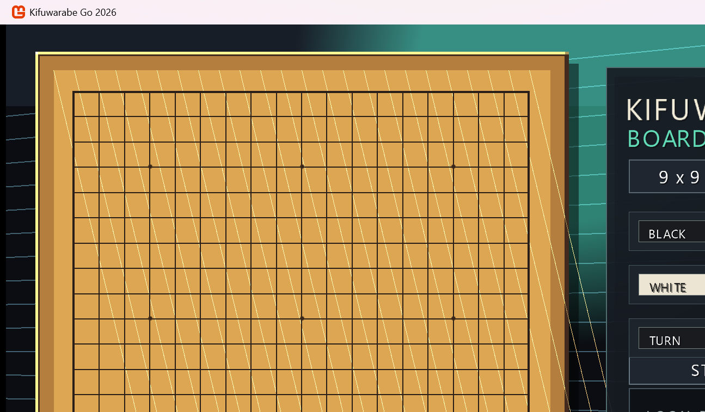

# 開発日誌 2026年7月

KifuwarabeGo2026 の 2026年7月分の開発日誌です。
上から下へ、古い日付から新しい日付の順に並べます。

## 2026-07-07

新しいリポジトリーとして `KifuwarabeGo2026` の方針を整理しました。

- コンピューター囲碁の思考エンジンを C# で作ることにしました。
- 画面表示には MonoGame を使うことにしました。
- 対局プロトコルには Go Text Protocol (GTP) を使う方針にしました。
- 標準入力と標準出力は GTP 専用にし、アプリケーション操作は画面上の UI で行う方針にしました。
- `Docs/README.md`、`Docs/続きはここから.md`、`Docs/設計/基本方針.md` を作り、作業再開時に見ればよい情報を残しました。

## 2026-07-08

MonoGame 上の囲碁画面を作り、画面操作の土台を入れました。

- フルHD想定の囲碁画面を作りました。
- 9路、13路、19路の盤サイズを切り替えられるようにしました。
- 描画処理を `Presentation/GoScreenRenderer.cs` へ分けました。
- 仮想スクリーン変換を `Presentation/VirtualScreen.cs` へ分けました。
- Esc キー終了をやめ、Windows の標準操作である Alt+F4 終了に寄せました。
- アプリの状態として、対局中、局面編集中、鑑賞中、休憩中を表すクラスを用意しました。
- 休憩中から対局中へ切り替える START ボタンを作りました。
- 対局中は、盤上の交点を左クリックして黒石と白石を交互に置けるようにしました。
- PASS ボタンで手番を進められるようにしました。
- 石を置ける交点へマウスを近づけると、現在の手番の石を薄く表示するようにしました。
- 石を置いたときとパスしたときに短い効果音を鳴らすようにしました。
- 今日の到達点として、開発日誌とスクリーンショットを追加しました。

## 2026-07-09

GTP エンジン連携の最初の段階を実装しました。

- GUI のセットアップ画面で、黒番・白番を `Human` / `Computer` から選べるようにしました。
- `KifuwarabeGo2026.Engine` コンソールプロジェクトを追加しました。
- ランダム合法手を返す最小 GTP エンジンを作りました。
- エンジンは標準入力から GTP コマンドを読み、標準出力へ GTP 応答だけを返します。
- GUI 側に `GtpEngineClient` と GTP 座標変換の土台を追加しました。
- `dotnet build KifuwarabeGo2026.slnx` が成功することを確認しました。
- エンジン単体で `protocol_version`、`boardsize 9`、`play black D4`、`genmove white`、`quit` の応答を確認しました。
- GUI の対局開始時に GTP エンジンを起動し、`boardsize` と `clear_board` を送るようにしました。
- 人間の着手とパスを、`play black D4` や `play white pass` の形でエンジンへ同期するようにしました。
- `Computer` 手番では `genmove` を送り、返ってきた手を GUI 側の合法手処理へ通して盤へ反映するようにしました。
- エンジン準備中や思考中は盤を隠し、`コンピューター準備中` と `対局をキャンセル` ボタンを表示するようにしました。
- 準備が終わっていないのに盤が表示される問題を直しました。
- 準備中画面の日本語表示が文字化けしていたため、フォント設定を直しました。
- 今日は遅いので、スクリーンショットは追加しませんでした。

## 2026-07-10

GTP エンジン連携を進め、エラー表示、終局時の後始末、複数エンジンプロセス化の途中まで進めました。

- エンジンエラー時に、盤面領域へ `エンジンエラー`、エラー内容、GTPログ保存先を表示するようにしました。
- 対局中の右パネルに `ENGINE` 状態として `STARTING` / `THINKING` / `READY` / `ERROR` を表示するようにしました。
- セッション状態に `EngineLogPath` を追加しました。
- 投了、二連続パス、コンピューター着手による終局時に GTP エンジンプロセスを閉じるようにしました。
- 黒番・白番を両方 `Computer` にした場合に備え、黒用・白用の GTP エンジンプロセスを別々に起動する実装へ変更中です。
- コンピューターが打った手を、着手した本人以外の GTP エンジンへ `play` で同期する処理を追加しました。
- 共有ログ `logs/gtp.log` に `[black-engine]` / `[white-engine]` の接頭辞を付けるようにしました。
- セットアップ画面で `Computer` 選択時に、既定エンジン名 `Kifuwarabe Random GTP` を表示するようにしました。
- `Docs/開発/GTPエンジン連携実装計画.md` の古い未実装記述を、現在の実装状況へ合わせて更新しました。
- `dotnet build KifuwarabeGo2026.slnx` が警告なしで成功することを確認しました。
- 終局時の GTP エンジン終了処理追加後、`dotnet build KifuwarabeGo2026.slnx` が警告なしで成功することを確認しました。
- 複数 GTP エンジンプロセス化の途中実装後、`dotnet build KifuwarabeGo2026.slnx` が警告なしで成功することを確認しました。
- エンジン単体で `protocol_version`、`name`、`boardsize 9`、`clear_board`、`play black D4`、`genmove white`、`quit` の応答を確認しました。
- 次は、黒番 `Computer`、白番 `Computer` で実際に対局を開始し、別プロセス同士で自動着手と相手手同期が進むか確認します。

## 2026-07-12

設定画面まわりの操作性を大きく整え、盤面の連解析表示を追加しました。

- 純碁スコアによる勝敗判定を入れ、結果画面に「何手で終局したか」を表示するようにしました。
- タイトル画面に残っていた不要な `MODE RESTING` 表示を削除しました。
- 大会ルール設定を追加パネルへ分離し、表示名入力、ファイル参照、編集、削除、複製をできるようにしました。
- テキストボックスへキーリピート、クリック位置へのキャレット移動、キャレット位置補正を入れ、表示名入力を扱いやすくしました。
- 思考エンジン設定パネルにも追加、編集、削除、複製を入れ、実行ファイルとワーキングディレクトリーを参照ボタンから選べるようにしました。
- `HUMAN` / `COMPUTER` の選択を一体型セグメントに寄せ、ボタン、ラベル、設定項目の見た目を調整しました。
- 大会ルール設定パネルと思考エンジン設定パネルのラベル表現を共通化し、押せる場所と読ませる場所の見分けを付けやすくしました。
- 盤面を左上から走査して、黒連、白連、空連へ分割し、連番号を振る連解析を実装しました。
- `R` キーで連解析表示を切り替え、盤上に連番号と連の境界を重ねて表示できるようにしました。
- 連解析結果は盤面サイズと盤面ハッシュでキャッシュし、同じ局面では再解析しないようにしました。
- README の上部にリンク集を追加し、リリースページと開発日誌へすぐ移動できるようにしました。
- README のドキュメント節にあった開発日誌リンクは、上部リンク集へ移して重複を減らしました。
- CGOS 練習サーバーへ接続する独立プロジェクト `KifuwarabeGo2026.Communication.Cgos` を追加しました。
- CGOS 通信クライアントは `uec-go.com:6809` へ接続し、黒番 `KifuwarabeB`、白番 `KifuwarabeW` でログインできるようにしました。
- CGOS 通信クライアントは `Ctrl+C` 時に CGOS へ `quit` を送って切断し、起動中の GTP エンジンも終了するようにしました。
- GUI の最初の選択画面に `Local (推奨)` と `Connect To CGOS` を追加しました。
- ローカル利用と CGOS 接続を見分けやすいよう、閉じた箱と外部サーバーへつながる箱のアイコンを描画しました。
- `Connect To CGOS` から進む CGOS 接続先リスト画面を追加しました。
- CGOS 接続先リストに `PREV`、`NEXT`、`ADD`、`EDIT`、`DUPLICATE`、`DELETE` を追加しました。
- CGOS 接続先プロファイルの追加、編集、複製、削除、ページ移動をできるようにしました。
- 編集パネルで `DISPLAY NAME`、`HOST`、`PORT`、`ROLE`、`NOTE` を編集できるようにしました。
- CGOS 接続先プロファイルを `Content/CgosConnections/cgos-connection-list.json` へ JSON 形式で保存するようにしました。
- 次回は、`Connect To CGOS` の接続先を選んだ後、実際の接続開始画面または接続中画面へ進む部分から作ります。

## 2026-07-13

`Connect To CGOS` の接続先選択後のフローを進めました。

- CGOS 接続先リストに `CONNECT` ボタンを追加しました。
- 選択中の接続先から、接続開始画面へ進めるようにしました。
- 接続開始画面で `TARGET` と `STATUS` を確認できるようにしました。
- `START CONNECT` ボタンを追加し、GUI 側で接続開始要求状態を持てるようにしました。
- `BACK` で接続開始画面から接続先リストへ戻れるようにしました。
- `dotnet build KifuwarabeGo2026.slnx` が警告なしで成功することを確認しました。
- GUI の `START CONNECT` から `KifuwarabeGo2026.Communication.Cgos` を起動できるようにしました。
- 接続中は `START CONNECT` を `STOP CONNECT` に切り替え、標準入力へ `quit` を送って通信クライアントを停止できるようにしました。
- CGOS 通信クライアントは標準入力の `quit`、`exit`、`cancel` でもキャンセルし、既存のログアウト処理で CGOS へ `quit` を送るようにしました。
- `dotnet build KifuwarabeGo2026.slnx` が警告なしで成功することを確認しました。
- CGOS 通信クライアントの標準出力と標準エラーの最新行を GUI 側で保持するようにしました。
- 接続開始画面の `STATUS` に `MESSAGE` 欄を追加し、接続処理の直近メッセージを見られるようにしました。
- `dotnet build KifuwarabeGo2026.slnx` が警告なしで成功することを確認しました。
- 接続開始画面の `ACCOUNT` を `BLACK`、`WHITE`、`BOTH` から選べるようにしました。
- GUI から起動する CGOS 通信クライアントへ、選択したアカウントを `--account black`、`--account white`、`--both` として渡すようにしました。
- `dotnet build KifuwarabeGo2026.slnx` が警告なしで成功することを確認しました。
- 接続開始画面の `ENGINE` を既存の GTP エンジンプロファイルから `PREV` / `NEXT` で選べるようにしました。
- GUI から起動する CGOS 通信クライアントへ、選択した GTP エンジンを `--engine-command` として渡すようにしました。
- `dotnet build KifuwarabeGo2026.slnx` が警告なしで成功することを確認しました。
- 接続開始画面の `ENGINE` に、選択中プロファイルの表示名と実行ファイル名、引数の概要を表示するようにしました。
- CGOS 通信クライアント起動時に、渡した engine command を `MESSAGE` 欄へ表示するようにしました。
- `dotnet build KifuwarabeGo2026.slnx` が警告なしで成功することを確認しました。
- 接続開始画面の `MESSAGE` 欄を下段の横長表示へ移し、表示幅を広げました。
- CGOS 通信クライアントの直近メッセージ保持数を 4 行から 8 行へ増やしました。
- `dotnet build KifuwarabeGo2026.slnx` が警告なしで成功することを確認しました。
- 接続開始画面の `ENGINE` 行は表示名だけを通常表示し、実行コマンドはマウスホバー時のポップアップで確認するようにしました。
- `MESSAGE` 欄の各行は短く表示し、マウスホバー時にその行の全文をポップアップで確認できるようにしました。
- `dotnet build KifuwarabeGo2026.slnx` が警告なしで成功することを確認しました。
- CGOS 接続開始画面の `ENGINE COMMAND` と `MESSAGE` のホバーポップアップを横長に広げ、全文を読みやすくしました。
- `dotnet build KifuwarabeGo2026.slnx` が警告なしで成功することを確認しました。
- CGOS 接続開始画面の `STATE` を、通信クライアントの直近ログから `CONNECTING`、`PROTOCOL`、`LOGIN`、`SETUP`、`PLAY`、`GENMOVE`、`GAME OVER`、`ERROR` などへ変化するようにしました。
- `dotnet build KifuwarabeGo2026.slnx` が警告なしで成功することを確認しました。
- GUI 側で CGOS 通信クライアントの標準出力だけでなく、起動後に作られた `Logs/Cgos/cgos-*.log` も読み取り、`MESSAGE` と `STATE` に反映するようにしました。
- CGOS サーバーへの TCP 接続が 15 秒以内に完了しない場合、通信クライアントが接続タイムアウトをログへ出して終了するようにしました。
- `dotnet build KifuwarabeGo2026.slnx` が警告なしで成功することを確認しました。
