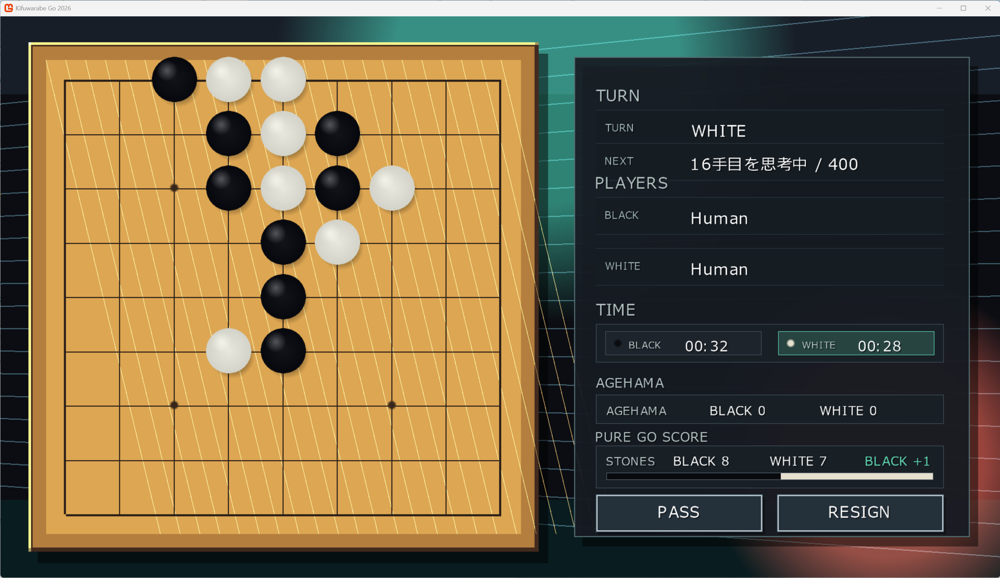

# きふわらべ碁２０２６

［きふわらべ碁２０２６］ は、C# / MonoGame をベースに AIコーディングしたコンピューター囲碁アプリケーションです。  
9路、13路、19路の対局画面を持ち、別プロセスの GTP エンジンと接続して人間対コンピューター、コンピューター同士の対局を動かせます。  

  


## 主な機能

- 9路、13路、19路の囲碁盤表示
- 人間対人間、人間対コンピューター、コンピューター対コンピューターの対局
- Go Text Protocol (GTP) による外部思考エンジン連携
- 同梱のランダム合法手 GTP エンジン `Kifuwarabe Random GTP`
- 大会ルール設定の追加、編集、複製、削除
- GTP エンジン設定の追加、編集、複製、削除
- SGF 棋譜の読み込み、局面編集、棋譜レビュー
- `R` キーによる連解析表示


## 動作環境

- Windows
- .NET 8 SDK


## 起動方法

```powershell
dotnet run --project KifuwarabeGo2026\KifuwarabeGo2026.csproj
```

GTP エンジン単体を確認する場合:

```powershell
@('protocol_version','name','version','boardsize 9','clear_board','play black D4','genmove white','quit') | dotnet run --project KifuwarabeGo2026.Engine\KifuwarabeGo2026.Engine.csproj
```


## リリースビルド

```powershell
dotnet publish KifuwarabeGo2026\KifuwarabeGo2026.csproj -c Release -r win-x64 --self-contained false
dotnet publish KifuwarabeGo2026.Engine\KifuwarabeGo2026.Engine.csproj -c Release -r win-x64 --self-contained false
```

出力先:

- `KifuwarabeGo2026\bin\Release\net8.0-windows\win-x64\publish`
- `KifuwarabeGo2026.Engine\bin\Release\net8.0\win-x64\publish`


## ドキュメント

- [共有ドキュメント](./KifuwarabeGo2026/Docs/README.md)
- [開発日誌 2026年7月](./KifuwarabeGo2026/Docs/開発/開発日誌/2026-07.md)
