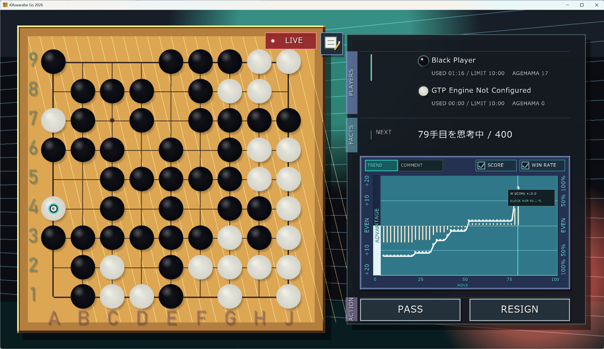
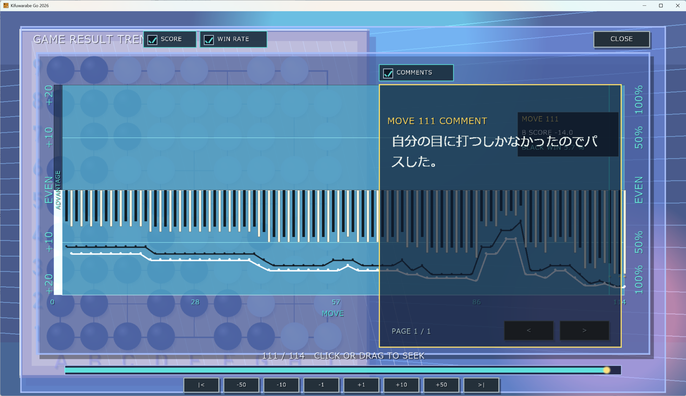
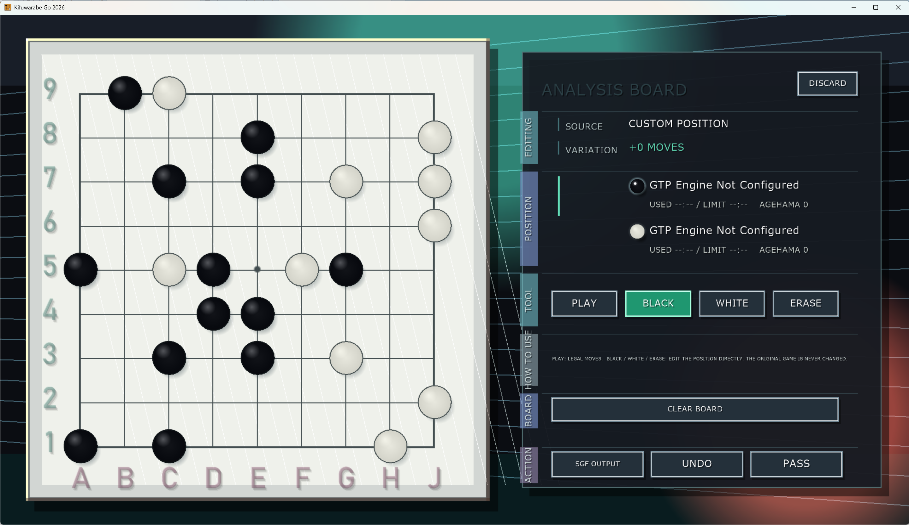

# きふわらべの碁２０２６

［きふわらべの碁２０２６］ は、［コンピューター囲碁の思考エンジン同士の対局］ができるアプリケーションです。  

例えば、電気通信大学の［コンピュータ囲碁フォーラムオープン２０２６］や、インターネット上のフリーのCGOSサーバー（コンピューター囲碁対局サーバー）に参加可能な程度の機能をサポートできる実績があります。  

開発者は［むずでょ］（人間）です。主に［Codex］、たまに［Copilot］（ＡＩエージェント）と一緒に開発しています。  

  
（画面は開発中のものです。 v2.5.0）  

  
（画面は開発中のものです。 v2.5.0）  

  
（画面は開発中のものです。 v2.5.0）  

## ダウンロード

- [最新版をダウンロードする](https://github.com/muzudho/KifuwarabeGo2026/releases/latest)

> [!IMPORTANT]
> 通常利用者がダウンロードするのは、`KifuwarabeGo2026.Launcher-v～-win-x64.zip` だけです。ZIPを展開して `KifuwarabeGo2026.Launcher.exe` を起動し、ランチャーの［CHECK GUI + ENGINE UPDATES］からGUIとEngineを取得してください。
>
> `.zip.sha256` はランチャーがダウンロードの破損・改ざん検証へ使用する機械向けファイルです。利用者がダウンロードしたり開いたりする必要はありません。GUI版・Engine版のZIPは、単独利用や互換運用が必要な方向けです。

### v3.10.0 以前から更新する方へ

v3.10.0 の［最新バージョンへ更新］は GUI 用 ZIP だけを取得する旧方式のため、共通ランチャーへ自動移行できません。
リリースページから最新版を手動でダウンロードし、別のフォルダーへすべて展開して、`KifuwarabeGo2026.Launcher.exe` を起動してください。
古いショートカットはランチャーへのショートカットに作り直してください。旧更新機能が保存した版は、ランチャーのインストール済みバージョン画面でアンインストールできます。

### 使わなくなったバージョンの削除

`KifuwarabeGo2026.Launcher.exe` のインストール済みバージョン画面では、GUI、Engine、および旧更新機能が `%LOCALAPPDATA%\KifuwarabeGo2026\Updates` に保存した版をアンインストールできます。
現在使用中の版とロールバック用の直前版は、誤削除を防ぐためアンインストールできません。

### 共通ランチャー

`KifuwarabeGo2026.Launcher.exe` を毎回の起点として使用します。ランチャーでは次の操作ができます。

- current GUIの起動。起動できない場合はprevious GUIへフォールバックします。
- GUIとEngineの個別更新、または両方の更新確認。
- current Engineの保存場所を開く。
- インストール済み版と旧更新機能が残した版の確認・アンインストール。
- `%LOCALAPPDATA%\KifuwarabeGo2026\Logs\launcher.log` による障害調査。

更新中はcurrentを変更しません。ダウンロード、展開、必須ファイル、ファイルバージョンの検証にすべて成功した後だけ、`launcher-settings.json` のcurrentとpreviousを切り替えます。
旧更新機能の `%LOCALAPPDATA%\KifuwarabeGo2026\Updates` は自動移行しません。不要ならランチャーで削除し、必要な版はランチャーから正式に再取得してください。

ランチャー画面はWindows Formsではなく、GUI本体と共有する文房具UIとMonoGame DesktopGLで構成しています。更新・版管理を行う `Launcher.Core`、文房具UI画面、Windows／Linux／macOSのOSアダプターを分離しており、正式配布対象は当面Windows x64のまま、他OSへ移植できる構造です。

## 囲碁エンジンを作りたい人向け

［きふわらべの碁２０２６］で動くGTPエンジンを作るための目次です。外部のGTP仕様書を探さなくても実装へ取り掛かれる公開リファレンスを用意しています。

1. [Play（通常の囲碁対局）](./KifuwarabeGo2026.GameOasis.Gui/PublicDocs/GoApps/Play/README.md)
2. [ポン抜き](./KifuwarabeGo2026.GameOasis.Gui/PublicDocs/GoApps/Ponnuki/README.md)

## きふわらべの碁２０２６の開発に参加したい方

- [リポジトリ開発者向けREADME](./README.developer.md)

## 主な機能

- 9路、13路、19路の囲碁盤表示
- 人間対人間、人間対コンピューター、コンピューター対コンピューターの対局
- Go Text Protocol (GTP) による外部思考エンジン連携
- 同梱のランダム合法手 GTP エンジン `Kifuwarabe Random GTP`
- 大会ルール設定の追加、編集、複製、削除
- GTP エンジン設定の追加、編集、複製、削除
- SGF 棋譜の読み込み、局面編集、棋譜レビュー
- `L` キーで切り替える `BOARD LENS` 表示
- CGOS サーバーへの接続（CGF Open 2026 への参加の実績有り）
- 大会ルール、思考エンジン、CGOS接続先を使いたい順に並べ替える順序編集

## 動作環境

- Windows x64
- .NET 8 Desktop Runtime

プログラム開発用のSDKやVisual Studioは必要ありません。

> [!Note]
> 現在、作者が動作確認している環境はWindowsだけです。

## 起動方法

1. [リリースページ](https://github.com/muzudho/KifuwarabeGo2026/releases/latest)を開きます。
2. `KifuwarabeGo2026.Launcher-v～-win-x64.zip` をダウンロードします。末尾が `.zip.sha256` のファイルではありません。
3. ZIPファイルを右クリックし、［すべて展開］で展開します。
4. `KifuwarabeGo2026.Launcher.exe` をダブルクリックします。
5. ［CHECK GUI + ENGINE UPDATES］を押し、GUIとEngineを取得します。
6. ［START］を押してGUIを起動します。以後もランチャーを入口として使用します。

> [!IMPORTANT]
> リリースページで似た名前が2つ並んでいる場合、ダウンロードするのはサイズが大きい `.zip` の方です。小さい `.zip.sha256` はランチャー用の検証データです。

起動時にWindowsから確認画面が出た場合は、ダウンロード元がこのGitHubリポジトリのリリースページであることを確認してから操作してください。
